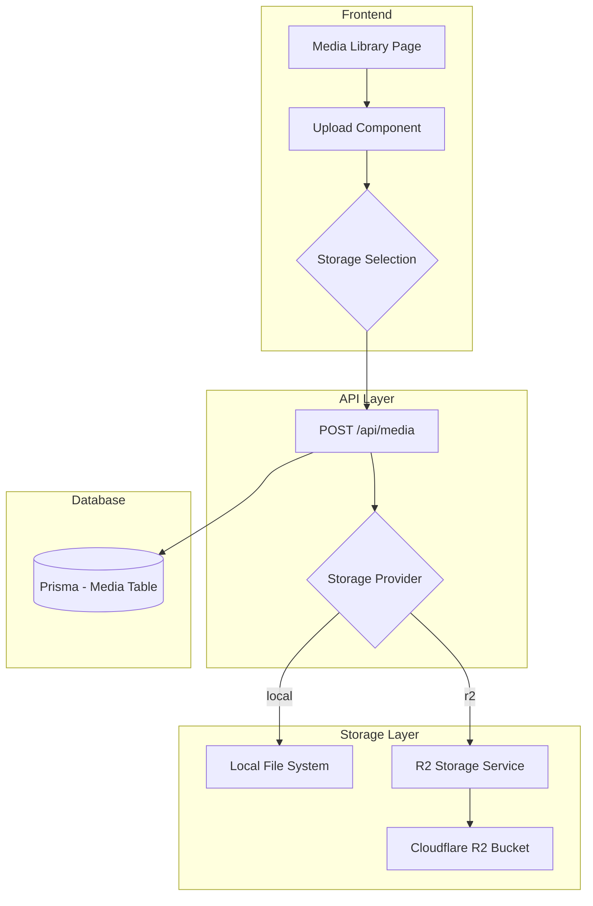

# Design Document: R2 Object Storage Integration

## Overview

Tích hợp Cloudflare R2 Object Storage vào hệ thống Media Library hiện tại, cho phép admin chọn lưu trữ file trên local hoặc R2. Sử dụng AWS SDK v3 (tương thích S3 API) để giao tiếp với R2.

## Architecture



## Components and Interfaces

### 1. Storage Service Interface

```typescript
// src/lib/storage/types.ts
export type StorageProvider = 'local' | 'r2';

export interface StorageConfig {
  provider: StorageProvider;
  r2?: {
    accountId: string;
    accessKeyId: string;
    secretAccessKey: string;
    bucketName: string;
    publicUrl: string;
  };
}

export interface UploadResult {
  url: string;
  filename: string;
  size: number;
  mimeType: string;
  width?: number;
  height?: number;
}

export interface StorageService {
  upload(file: Buffer, filename: string, mimeType: string): Promise<UploadResult>;
  delete(filename: string): Promise<boolean>;
  getUrl(filename: string): string;
}
```

### 2. R2 Storage Service

```typescript
// src/lib/storage/r2.ts
import { S3Client, PutObjectCommand, DeleteObjectCommand } from '@aws-sdk/client-s3';

export class R2StorageService implements StorageService {
  private client: S3Client;
  private bucketName: string;
  private publicUrl: string;

  constructor(config: StorageConfig['r2']) {
    this.client = new S3Client({
      region: 'auto',
      endpoint: `https://${config.accountId}.r2.cloudflarestorage.com`,
      credentials: {
        accessKeyId: config.accessKeyId,
        secretAccessKey: config.secretAccessKey,
      },
    });
    this.bucketName = config.bucketName;
    this.publicUrl = config.publicUrl;
  }

  async upload(file: Buffer, filename: string, mimeType: string): Promise<UploadResult>;
  async delete(filename: string): Promise<boolean>;
  getUrl(filename: string): string;
}
```

### 3. Local Storage Service

```typescript
// src/lib/storage/local.ts
export class LocalStorageService implements StorageService {
  private uploadDir: string;
  private publicPath: string;

  constructor(folder: string = 'uploads') {
    this.uploadDir = path.join(process.cwd(), 'public', folder);
    this.publicPath = `/${folder}`;
  }

  async upload(file: Buffer, filename: string, mimeType: string): Promise<UploadResult>;
  async delete(filename: string): Promise<boolean>;
  getUrl(filename: string): string;
}
```

### 4. Storage Factory

```typescript
// src/lib/storage/index.ts
export function getStorageService(provider: StorageProvider): StorageService {
  if (provider === 'r2') {
    const config = getR2Config();
    if (!config) throw new Error('R2 not configured');
    return new R2StorageService(config);
  }
  return new LocalStorageService();
}

export function isR2Configured(): boolean {
  return !!(
    process.env.R2_ACCOUNT_ID &&
    process.env.R2_ACCESS_KEY_ID &&
    process.env.R2_SECRET_ACCESS_KEY &&
    process.env.R2_BUCKET_NAME &&
    process.env.R2_PUBLIC_URL
  );
}
```

## Data Models

### Updated Prisma Schema

```prisma
model Media {
  id              String   @id @default(cuid())
  filename        String
  originalName    String
  mimeType        String
  size            Int
  url             String
  thumbnailUrl    String?
  alt             String?
  title           String?
  caption         String?
  width           Int?
  height          Int?
  folder          String?
  storageProvider String   @default("local") // "local" or "r2"
  uploadedBy      String?
  createdAt       DateTime @default(now())
  updatedAt       DateTime @updatedAt
}
```

### Environment Variables

```env
# R2 Configuration
R2_ACCOUNT_ID=your_account_id
R2_ACCESS_KEY_ID=your_access_key_id
R2_SECRET_ACCESS_KEY=your_secret_access_key
R2_BUCKET_NAME=your_bucket_name
R2_PUBLIC_URL=https://your-bucket.your-domain.com
```


## Correctness Properties

*A property is a characteristic or behavior that should hold true across all valid executions of a system-essentially, a formal statement about what the system should do. Properties serve as the bridge between human-readable specifications and machine-verifiable correctness guarantees.*

### Property 1: Fallback to Local Storage
*For any* system configuration where R2 environment variables are missing or incomplete, the storage service SHALL default to local storage provider.
**Validates: Requirements 1.4, 6.2**

### Property 2: Unique Filename Generation
*For any* file upload to any storage provider, the resulting filename SHALL contain a timestamp prefix ensuring uniqueness.
**Validates: Requirements 3.2**

### Property 3: Storage Provider Tracking
*For any* newly created media record, the storageProvider field SHALL be set to either "local" or "r2" matching the actual storage location.
**Validates: Requirements 5.1**

### Property 4: Correct Storage Service Selection
*For any* media deletion operation, the system SHALL use the storage service matching the storageProvider field in the media record.
**Validates: Requirements 4.3**

### Property 5: WebP Conversion Consistency
*For any* image upload (JPEG/PNG) with WebP conversion enabled, the output SHALL be WebP format regardless of whether storage provider is "local" or "r2".
**Validates: Requirements 3.5**

### Property 6: Default Provider Behavior
*For any* upload request without explicit storage provider specified, the system SHALL use the configured default storage provider.
**Validates: Requirements 2.3**

## Error Handling

| Scenario | Handling |
|----------|----------|
| R2 not configured | Fallback to local storage, disable R2 option in UI |
| R2 upload fails | Return error, do not create media record |
| R2 delete fails | Log error, still delete database record |
| Invalid file type | Return 400 error before upload attempt |
| File too large | Return 400 error before upload attempt |
| R2 credentials invalid | Return error on validation, prevent saving |

## Testing Strategy

### Unit Tests
- Test `isR2Configured()` with various env configurations
- Test `getStorageService()` returns correct service type
- Test filename generation includes timestamp
- Test WebP conversion for both providers

### Property-Based Tests
Using fast-check library for property-based testing:

1. **Property 1 Test**: Generate random partial R2 configs, verify fallback to local
2. **Property 2 Test**: Generate random filenames, verify timestamp prefix pattern
3. **Property 3 Test**: Generate random uploads, verify storageProvider field is set correctly
4. **Property 4 Test**: Generate media records with different providers, verify correct service is used for deletion
5. **Property 5 Test**: Generate random JPEG/PNG images, verify WebP output for both providers
6. **Property 6 Test**: Generate uploads without provider, verify default is used

### Integration Tests
- Test full upload flow to local storage
- Test full upload flow to R2 (with mocked S3 client)
- Test deletion from both providers
- Test API endpoints with various parameters

